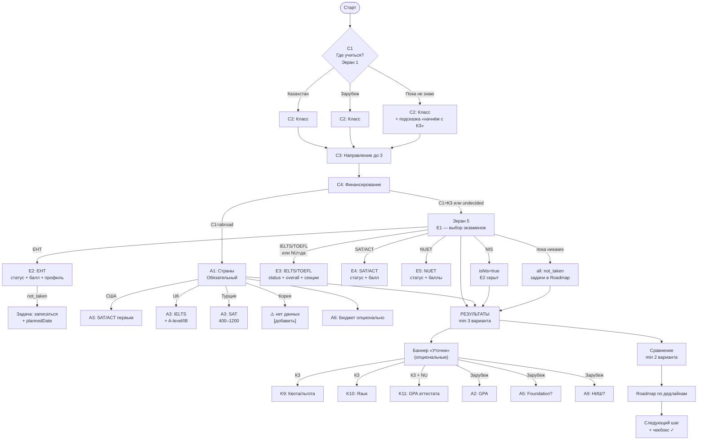

# Locus — Адаптивный флоу вопросов (19.09.2026)

> Полная схема: 5 обязательных экранов → результаты → опциональные уточнения → Roadmap.
> Все пороги исправлены по аудиту. Дата-контекст учтён.

---

## Дерево флоу (полная схема)



---

## Экран 1 — C1: Маршрут

| Ответ | `route` | Что открывает |
|---|---|---|
| 🇰🇿 Казахстан | `kz` | КЗ-ветка: E1–E5, K9–K11, NU-тумблер |
| 🌍 Зарубеж | `abroad` | A1 обязательный, A2–A9 |
| 🤔 Пока не знаю | `undecided` | КЗ-ветка + подсказка |

> Первый вопрос — разрывает дерево. IELTS 6.0 для NU и для UK дают разные следствия.

---

## Экран 2 — C2: Класс

| Ответ | `grade` | Таймлайн на 19.09.2026 |
|---|---|---|
| 9 класс | `9` | ЕНТ в июне 2028. Шаг: начало подготовки |
| 10 класс | `10` | ЕНТ в июне 2027. Шаг: пробный ЕНТ в январе 2027 |
| **11 класс** | `11` | **ЕНТ май–июль 2027. Сейчас: подготовка + пробный ЕНТ янв/мар 2027. НЕ «конкурс гранта»!** |
| Выпускник | `graduate` | Авг. 2026 прошёл. Ближайшая платная: январь 2027 |

---

## Экран 3 — C3: Направление (до 3 выборов)

| Вариант | `Field` | Профиль ЕНТ | Порог |
|---|---|---|---|
| 🏥 Медицина / Фармация | `medicine` | `bio-chem` | **70** |
| 💻 IT / Инженерия | `it` | `math-informatics`, `math-physics` | 65 / 50 |
| 📊 Бизнес / Экономика | `business` | `math-physics`, `worldhistory-geography` | 50–65 |
| ⚖️ Право | `law` | `worldhistory-law` | **75** |
| 📚 Гуманитарные | `humanities` | `lang-worldhistory`, `kazlit`, `ruslit` | 50–75 |
| 🔬 Естественные науки | `science` | `bio-geography`, `chem-physics` | 50–65 |
| 🎨 Творческие | `creative` | `creative` | 50 |
| ❓ Не знаю | `undecided` | показать все | 50 |

---

## Экран 4 — C4: Финансирование

| Ответ | `Funding` | Логика |
|---|---|---|
| 🏆 Только грант | `grant_only` | Только основная сессия ЕНТ май–июль. Конкурс гранта. |
| 🔄 Грант или контракт | `grant_or_contract` | Обе опции, грант выше в сортировке |
| 💳 Только контракт | `contract_ok` | Все сессии. Порог от 50. NUFYP доступен. |

---

## Экран 5 — E1: Выбор экзаменов (multi-select)

```
┌─────────────────────────────────────────┐
│  Какие экзамены сдал или сдаёшь?        │
│                                         │
│  ☐ ЕНТ            ☐ IELTS               │
│  ☐ TOEFL          ☐ SAT                 │
│  ☐ ACT            ☐ NUET                │
│  ☐ Сертификат НИШ (NIS Grade 12)        │
│  ☐ Пока никаких                         │
└─────────────────────────────────────────┘
```

### E2 — ЕНТ (раскрывается если E1 ⊇ ЕНТ)

```
Статус:  ○ Сдал  ○ Пробный  ○ Не сдавал
Балл:    [___]   (только если сдал / пробный)
Профиль: [выпадающий список]
  math-physics       → Математика + Физика
  math-informatics   → Математика + Информатика
  math-geography     → Математика + География
  bio-chem           → Биология + Химия
  bio-geography      → Биология + География
  lang-worldhistory  → Ин.язык + Всемирная история
  worldhistory-law   → Всемирная история + Право
  worldhistory-geo   → Всемирная история + География
  kazlit / ruslit    → Казахская/Русская литература
  chem-physics       → Химия + Физика
  creative           → Творческий экзамен
```
> `status = не сдавал` → балл не спрашивается → создаётся задача `exam_planned` + `plannedDate`

---

### E3 — IELTS/TOEFL (если E1 ⊇ {IELTS, TOEFL} **или** NU-тумблер = да)

```
Статус:  ○ Сдал  ○ Пробный  ○ Не сдавал
Overall: [_._]
Listening: [_._]   Reading:  [_._]
Writing:   [_._]   Speaking: [_._]
```
> Метка: «NU Regular: Overall ≥6.0, Writing ≥6.0, L/S/R ≥5.5»
> Метка: «NUFYP: Overall ≥5.5, W/R ≥5.5, L/S ≥5.0»

---

### E4 — SAT/ACT (если E1 ⊇ {SAT, ACT})

```
Тип:    ○ SAT Digital   ○ ACT
Статус: ○ Сдал  ○ Пробный  ○ Не сдавал
Балл:   [____]
```
> Метка: «NU Regular ≥1240 SAT / ≥26 ACT | NU Mid-year (платно) ≥1150 SAT / ≥23 ACT»

---

### E5 — NUET (если E1 ⊇ NUET)

```
Статус:         ○ Сдал  ○ Пробный  ○ Не сдавал
Общий балл:     [___]
Математика:     [___]    Крит. мышление: [___]
```
> Метка: «NU грант: общий ≥120, каждый ≥50 | NU mid-year: общий ≥130, каждый ≥60»

---

### NIS-флаг (если E1 ⊇ NIS)

```
isNis = true
→ E2 (ЕНТ) СКРЫТ
→ КЗ: категория NU Cat.2 (ABB в 3 предметах + IELTS 6.0)
→ UK: UCAS принимает NIS = A-Level (UK ENIC ✅)
→ USA: SAT/TOEFL вероятно нужны [проверить политику вуза]
```

---

### NU-тумблер (опционально, всегда в КЗ-ветке)

```
Интересует NU? [ДА] [НЕТ]
При ДА → раскрыть E3 + K11 (GPA)
         + дедлайн-алерт (если date > 17 авг.)
```

---

## Зарубеж — A1: Страны (обязательный для ветки abroad)

| Страна | Порядок экзаменов в A3 | SAT порог |
|---|---|---|
| 🇺🇸 США | SAT/ACT → TOEFL/IELTS | По вузу (большинство SAT optional top-school) |
| 🇬🇧 UK | IELTS → A-level/IB / NIS | По вузу (UCL 1490, Oxford 1400) |
| 🇹🇷 Турция | SAT → TOEFL | Bilkent 1000, METU 1200, Sabancı 1100, Koç 1180 |
| 🇰🇷 Корея | ⚠️ нет данных | ⚠️ вкладка отсутствует в Sheets |

---

## Полная таблица вопросов

| Экр. | ID | Вопрос | Тип | Обяз. | Условие показа | На что влияет |
|:---:|---|---|---|:---:|---|---|
| 1 | **C1** | Где учиться? | single | ✅ | Всегда | Ветка |
| 2 | **C2** | Класс? | single | ✅ | Всегда | Таймлайн, сессии |
| 3 | **C3** | Направления (до 3) | multi | ✅ | Всегда | Пороги, профиль |
| 4 | **C4** | Финансирование? | single | ✅ | Всегда | Сессии, фильтр |
| 5 | **E1** | Какие экзамены? | multi | ✅ | C1 ≠ abroad | Пул, split |
| 5 | **E2** | ЕНТ: статус+балл+профиль | composite | ✅ при ЕНТ | E1 ⊇ ент | Fit, gap |
| 5 | **E3** | IELTS/TOEFL: секции | composite | — | E1 ⊇ ielts/toefl **или** NU=да | NU fit |
| 5 | **E4** | SAT/ACT: балл | composite | — | E1 ⊇ sat/act | KBTU, NU mid |
| 5 | **E5** | NUET: баллы | composite | — | E1 ⊇ nuet | NU regular/mid |
| 5 | **NU** | Интересует NU? | toggle | — | C1=kz | E3/E5/K11 |
| — | **A1** | Страны | multi | ✅ abroad | C1=abroad | Пул, экзамены |
| op | **A2** | GPA | number | — | C1=abroad | Пороги вузов |
| op | **A3** | Экзамены за рубеж | matrix | — | C1=abroad | Fit |
| op | **A5** | Foundation year? | single | — | C1=abroad | Plan B |
| op | **A6** | Бюджет | single | — | C1=abroad AND C4≠grant | Фильтр стран |
| op | **A9** | НИШ выпускник? | single | — | C1=abroad | UK UCAS NIS |
| op | **K9** | Квота/льгота? | single | — | C1=kz | Задача «документы» |
| op | **K10** | Язык обучения | single | — | C1=kz | Фильтр программ |
| op | **K11** | GPA аттестата | number | — | NU=да | NU: ≥4.0/5.0 |

---

## Все динамические условия

```
── ВЕТКИ ──────────────────────────────────────────────────────────────
C1 = kz          → E1–E5, NU-тумблер, K9–K11
C1 = abroad      → A1 (обязательный), A2–A9
C1 = undecided   → КЗ-ветка + подсказка

── РАСКРЫТИЕ ПОЛЕЙ ────────────────────────────────────────────────────
E1 ⊇ ent         → E2 (статус+профиль обязательны)
E1 ⊇ ielts/toefl → E3 (4 секции)
E1 ⊇ sat/act     → E4
E1 ⊇ nuet        → E5
E1 ⊇ nis         → isNis=true; E2 СКРЫТ
E1 = none        → all not_taken → задачи в roadmap
NU = true        → E3 или E5 + K11

── КОНТЕКСТ-ЗАВИСИМЫЕ ─────────────────────────────────────────────────
E2.status = not_taken  → task: exam_planned + plannedDate
C3 ⊇ medicine          → highlight порог 70, bio-chem
C4 = grant_only        → только сессия май–июль
A1 ⊇ us                → SAT/ACT первым
A1 ⊇ uk                → IELTS + A-level/IB
A9 = yes               → UK: NIS=A-Level ✅; US: SAT/TOEFL [проверить]

── ДАТОЗАВИСИМЫЕ (19.09.2026) ──────────────────────────────────────────
grade = 11 AND month ∈ {9..4}
  → roadmap_mode = preparation
  → nextStep = «Пробный ЕНТ январь 2027»
  → СКРЫТЬ «конкурс гранта» до мая 2027

NU = true AND today > 2026-08-17
  → ALERT: «Цикл 2025/2026 закрыт»
  → SHOW: «Новый цикл открывается 27 сентября 2026 — через 8 дней»

isNis = true AND abroad ⊇ uk AND today < 2026-10-15
  → URGENT ALERT: «UCAS Oxbridge: дедлайн 15 октября 2026 — осталось 26 дней»
  → INFO: «Остальные UK вузы: 29 января 2027»
```

---

## Gap → Roadmap (полная таблица)

| Условие | `GapType` | Задача в Roadmap | Источник |
|---|---|---|---|
| ЕНТ < порога направления | `score_gap` | «+N баллов до порога X. Пробный ЕНТ январь 2027» | testcenter.kz |
| ЕНТ = не сдавал | `exam_planned` | «Зарегистрироваться на ЕНТ к [plannedDate]» | testcenter.kz |
| Профиль ≠ направление | `subject_mismatch` | «Сменить комбинацию ЕНТ или выбрать смежное направление» | — |
| NU = да, нет IELTS / GPA | `missing_exam` | «Сдать IELTS (цель 6.0, Writing 6.0) или NUET (цель 120/50)» | nu.edu.kz |
| grant_only + балл < прошлогоднего проходного | `funding_gap` | «План подъёма балла или смежные программы [демо-данные]» | [демо] |
| SAT < 1240 при интересе к NU | `score_gap` | «SAT [балл] < минимума NU 1240. Пересдать или перейти на ЕНТ-трек» | nu.edu.kz |
| Зарубеж + бюджет < стоимости страны | `budget_gap` | «Рассмотреть Турцию/Германию или стипендии [проверить]» | Sheets |
| NIS + UK + нет IELTS | `missing_exam` | «IELTS ≥6.5 для UK вузов (NIS = A-Level по UK ENIC)» | ukenic.ac.uk |
| UCAS Oxbridge < 26 дней | `deadline_alert` | «⚠️ 15 октября 2026: Personal Statement + дедлайн UCAS» | ucas.com |

---

## Пороги fit (верифицированные, P0 аудита)

### ЕНТ — допуск к участию

| `Field` | Минимум ЕНТ |
|---|---|
| `law` | **75** |
| `medicine` | **70** |
| `science` (агро/вет) | **60** |
| `it`, `business`, `humanities` (нац. ОВПО) | **65** |
| Все платные | **50** |

### NU — исправленные пороги

| Трек | Параметр | Минимум |
|---|---|---|
| Regular IELTS | Overall | **6.0** |
| Regular IELTS | Writing | **6.0** |
| Regular IELTS | L/S/R | **5.5** |
| Regular GPA | — | **4.0**/5.0 |
| Regular UNT | Общий | **≥85** |
| Regular SAT | — | **≥1240** ← исправлено |
| Regular ACT | — | **≥26** ← исправлено |
| Regular NUET (грант) | Общий | **≥120** ← исправлено |
| Regular NUET (грант) | Каждый | **≥50** ← исправлено |
| Mid-year NUET | Общий | **≥130** |
| Mid-year NUET | Каждый | **≥60** |
| Mid-year SAT | — | **≥1150** |
| Mid-year ACT | — | **≥23** |
| NIS Grade 12 | Оценки | **ABB** ← исправлено (было BBB) |
| NUFYP | Overall IELTS | **5.5** |

### Турция — SAT пороги (из Google Sheets)

| Вуз | SAT min | TOEFL min |
|---|---|---|
| METU Ankara | **1200** (math 680) | 75 |
| Bilkent Ankara | **1000** | 87 |
| Sabancı Istanbul | **1100** | 80 / ELAE |
| Koç Istanbul | **1180** (1200 eng.) | 80 (опц.) |
| Hacettepe Ankara | **1000** (500 math) | опц. |
| Ankara University | **1100** (math 650) | 79 |
| ITU Istanbul | **600** (math) | 65 |
| Atatürk Erzurum | **400** (200 math) | любой |

---

## Машиночитаемая спецификация (JSON)

```jsonc
{
  "flow": [
    { "id": "C1", "screen": 1, "type": "single", "required": true,
      "options": ["kz","abroad","undecided"], "affects": ["route","branch"] },

    { "id": "C2", "screen": 2, "type": "single", "required": true,
      "options": [9, 10, 11, "graduate"], "affects": ["timeline","ent_sessions"] },

    { "id": "C3", "screen": 3, "type": "multi", "required": true, "max": 3,
      "options": ["medicine","it","business","law","humanities","science","creative","undecided"],
      "affects": ["thresholds","ent_profile","pool"] },

    { "id": "C4", "screen": 4, "type": "single", "required": true,
      "options": ["grant_only","grant_or_contract","contract_ok"],
      "affects": ["sessions","filter","funding_gap"] },

    { "id": "E1", "screen": 5, "type": "multi", "required": true,
      "when": "C1 != 'abroad'",
      "options": ["ent","ielts","toefl","sat","act","nuet","nis","none"],
      "affects": ["pool_split","field_reveal"] },

    { "id": "E2", "screen": 5, "type": "composite",
      "required": "when E1 contains 'ent'",
      "when": "E1 contains 'ent'",
      "fields": [
        { "key": "status",  "type": "single",   "options": ["taken","trial","not_taken"], "required": true },
        { "key": "score",   "type": "number",    "show": "status != 'not_taken'" },
        { "key": "profile", "type": "single",    "options": "<EntProfileCombo>",          "required": true }
      ],
      "postCondition": { "if": "status == 'not_taken'", "then": "create gap:exam_planned + ask plannedDate" }
    },

    { "id": "E3", "screen": 5, "type": "composite", "required": false,
      "when": "E1 contains 'ielts' OR E1 contains 'toefl' OR NU == true",
      "thresholds": {
        "nu_regular": { "overall": 6.0, "writing": 6.0, "sections_min": 5.5 },
        "nufyp":      { "overall": 5.5, "writing_reading": 5.5, "ls": 5.0 }
      }
    },

    { "id": "E4", "screen": 5, "type": "composite", "required": false,
      "when": "E1 contains 'sat' OR E1 contains 'act'",
      "thresholds": {
        "nu_regular": { "sat": 1240, "act": 26 },
        "nu_midyear": { "sat": 1150, "act": 23 },
        "bilkent": 1000, "metu": 1200, "sabanci": 1100, "koc": 1180
      }
    },

    { "id": "E5", "screen": 5, "type": "composite", "required": false,
      "when": "E1 contains 'nuet'",
      "thresholds": {
        "nu_grant":   { "total": 120, "each": 50 },
        "nu_midyear": { "total": 130, "each": 60 }
      }
    },

    { "id": "NU", "screen": 5, "type": "toggle", "required": false,
      "when": "C1 == 'kz'",
      "onTrue": ["reveal:E3","reveal:E5","reveal:K11"] },

    { "id": "A1", "type": "multi", "required": true, "when": "C1 == 'abroad'",
      "options": ["us","uk","turkey","korea","germany","canada","other"],
      "warning": { "korea": "Данные по Корее отсутствуют в базе" }
    },

    { "id": "A2", "type": "number",  "required": false, "when": "C1 == 'abroad'" },
    { "id": "A3", "type": "matrix",  "required": false, "when": "C1 == 'abroad'" },
    { "id": "A5", "type": "single",  "required": false, "when": "C1 == 'abroad'",
      "options": ["yes","no","what_is_it"] },
    { "id": "A6", "type": "single",  "required": false,
      "when": "C1 == 'abroad' AND C4 != 'grant_only'",
      "options": ["lt5k","5to15k","15to30k","gt30k"],
      "mapping": { "lt5k": "Турция, Германия, Польша", "5to15k": "Австрия, Испания", "15to30k": "Канада, Нидерланды", "gt30k": "США, UK, Австралия" }
    },
    { "id": "A9", "type": "single",  "required": false, "when": "C1 == 'abroad'",
      "options": ["yes","no"],
      "onYes": { "uk": "NIS=A-Level ✅ UCAS", "us": "SAT/TOEFL вероятно нужны [проверить]" }
    },

    { "id": "K9",  "type": "single", "required": false, "when": "C1 == 'kz'",
      "options": ["yes","no","unsure"],
      "onYes": "create task: documents_quota" },
    { "id": "K10", "type": "single", "required": false, "when": "C1 == 'kz'",
      "options": ["kz","ru","en","any"], "default": "any" },
    { "id": "K11", "type": "number", "required": false, "when": "NU == true",
      "threshold": 4.0 }
  ],

  "postConditional": [
    { "when": "isNis",                "then": "hide E2" },
    { "when": "C3 includes medicine", "then": "highlight threshold 70; suggest bio-chem" },
    { "when": "C4 == grant_only",     "then": "sessions: main only (May–Jul)" },
    { "when": "E2.status == not_taken","then": "gap: exam_planned + plannedDate" },
    { "when": "grade==11 AND month in [9,10,11,12,1,2,3,4]",
      "then": "roadmap=preparation; next='Пробный ЕНТ январь 2027'; hide grant_competition" },
    { "when": "NU==true AND today > 2026-08-17",
      "then": "alert: 'Новый цикл NU открывается 27 сентября 2026'" },
    { "when": "isNis AND abroad includes uk AND today < 2026-10-15",
      "then": "urgent: 'UCAS Oxbridge: 15 октября 2026 — 26 дней'" }
  ]
}
```

---

## Эталонные прогоны T1–T7

| ID | Входные данные | C1→C2→C3→C4→E | Вывод модели |
|---|---|---|---|
| **T1** | 11кл, IT, грант, ЕНТ 96 (math-physics) | kz→11→it→grant→ent(96) | `fits`. Грант: `[демо]`. **Шаг: пробный ЕНТ янв.2027** |
| **T2** | 11кл, CS, контракт, IELTS 6.5, GPA 4.7, NU=да | kz→11→it→contract→ielts(6.5),NU=✓ | `fits` NU. **«Подать с 27 сент. 2026»**. Альт.: SAT≥1240 |
| **T3** | 10кл, медицина, грант, ЕНТ не сдавала | kz→10→medicine→grant→ent(not_taken) | Цель **≥70**, bio-chem. Задача: пробный янв.2027. Таймлайн 2027. |
| **T4** | 11кл, IT, контракт, SAT 1210 | kz→11→it→contract→sat(1210) | NU: **❌** 1210<1240. Варианты: пересдать SAT≥1240 или ЕНТ-трек |
| **T5** | НИШ-выпускница, IELTS 6.5 | kz→graduate→any→any→nis,ielts(6.5) | isNis=true. NU Cat.2: нужен **ABB**. UK: UCAS ✅. E2 скрыт. |
| **T6** | 11кл, зарубеж, бюджет <$5k, грант | abroad→11→any→grant→A1:us+uk,A6:lt5k | США/UK: ❌. Турция ✅: Ankara$665, Atatürk$340. Корея: ⚠️ нет данных. |
| **T7** | 11кл, UK, НИШ | abroad→11→any→any→nis,A1:uk,A9:yes | UK ENIC ✅. **⚠️ Oxbridge: 15 окт.2026 — 26 дней!** |
