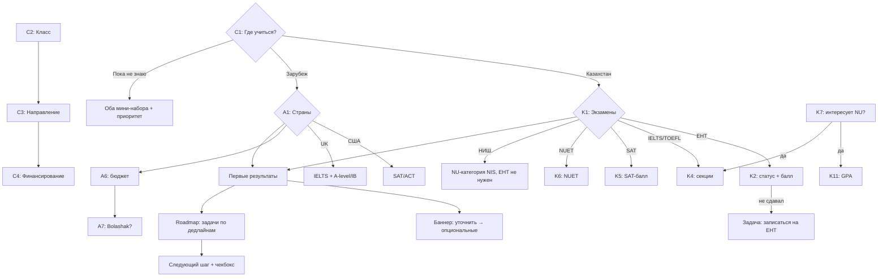

# LOCUS 2026 Case 2 — Research & Onboarding Design

> Сервис: персональный маршрут поступления в вузы Казахстана и зарубеж.
> Файл содержит: исследование критериев поступления (с источниками), структуру онбординга,
> ветки вопросов, механику результата, нестандартные кейсы и сценарии учеников.
> Код: минимум (тип Profile в приложении). Фокус — ресёрч и продуктовая логика.

**Код кейса:** LOCUSCASE2
**Аудитория:** ученики 9-11 классов и выпускники, поступающие на бакалавриат
**Ограничение по времени онбординга:** 2-3 минуты, ~10 экранов

---

## 1. Оглавление

1. [Кейс в двух абзацах](#2-кейс-в-двух-абзацах)
2. [Правила достоверности](#3-правила-достоверности)
3. [Исследование: как устроено поступление в Казахстане](#4-исследование-как-устроено-поступление-в-казахстане)
4. [Исследование: Nazarbayev University (отдельная система)](#5-исследование-nazarbayev-university-отдельная-система)
5. [Исследование: зарубеж (общий каркас)](#6-исследование-зарубеж-общий-каркас)
6. [Первый развилочный вопрос](#7-первый-развилочный-вопрос)
7. [Сквозные обязательные вопросы (C1-C4)](#8-сквозные-обязательные-вопросы-c1-c4)
8. [Ветка «Казахстан»: полный порядок вопросов](#9-ветка-казахстан-полный-порядок-вопросов)
9. [Ветка «Зарубеж»: полный порядок вопросов](#10-ветка-зарубеж-полный-порядок-вопросов)
10. [Обязательное vs опциональное](#11-обязательное-vs-опциональное)
11. [Динамические условия: что открывает что](#12-динамические-условия-что-открывает-что)
12. [Механика результата: пул, уровень соответствия, gaps, roadmap](#13-механика-результата-пул-уровень-соответствия-gaps-roadmap)
13. [Анти-перегрузка: что сразу, что потом](#14-анти-перегрузка-что-сразу-что-потом)
14. [Нестандартные кейсы](#15-нестандартные-кейсы)
15. [Сценарии учеников](#16-сценарии-учеников)
16. [Адаптивная схема веток](#17-адаптивная-схема-веток)
17. [Источники и статус проверки](#18-источники-и-статус-проверки)
18. [Открытые вопросы для ресёрча](#19-открытые-вопросы-для-ресёрча)
19. [Приложение: тип Profile](#приложение-тип-profile)

---

## 2. Кейс в двух абзацах

**Проблема.** Абитуриенту нужен маршрут, а не список университетов. Поступление — это десятки решений:
направление, страна, вуз, экзамены, документы, дедлайны. Информация разрознена, рекомендации общие,
пользователь не понимает, что подходит именно ему и что делать прямо сейчас.

**Продукт.** AI-сервис, который проводит пользователя от короткой анкеты до персонального плана:
1) Вход — ценность сервиса; 2) Профиль — анкета; 3) Диагностика — резюме профиля;
4) Рекомендации — минимум 3 варианта с объяснением «почему подходит»;
5) Сравнение — минимум 2 варианта по важным параметрам;
6) Roadmap — экзамены, документы, дедлайны, активности;
7) Следующее действие — один чёткий ближайший шаг с возможностью отметить прогресс.

**Критические ограничения кейса:**
- запрещены вымышленная точность, гарантии поступления, неподтверждённые дедлайны;
- рекомендации объясняются человеческим языком;
- после изменения ключевого ответа рекомендации/маршрут заметно меняются;
- факты и дедлайны сопровождаются источниками или пометкой «демо-данные»;
- полный путь работает на мобильном экране.

---

## 3. Правила достоверности

Эти правила — часть продуктовой логики, а не просто пожелания:

1. **Никакой «вероятности» и процентов.** Только три уровня соответствия: «соответствует»,
   «близко», «не проходит». Модель, которой разрешили «вероятность», нарисует проценты — это запрещено кейсом.
2. **Не выдумывать числа и правила.** Всё, в чём нет уверенности, помечать
   `[проверить по официальному источнику]`. Пороги ЕНТ, правила NU, квоты меняются по годам.
3. **У каждого факта в данных — источник или пометка `[демо-данные]`.** Неподтверждённые
   требования и дедлайны без пометки запрещены.
4. **Статус экзамена из трёх значений:** `сдал / пробный / не сдавал`. «Не сдавал» — это `null`
   баллов и задача в roadmap, а не ноль.
5. **Льготы/квоты — минимально и без причин.** Один опциональный вопрос «есть ли право на квоту
   или льготу» со ссылкой на официальные правила. Без разбора обстоятельств.

---

## 4. Исследование: как устроено поступление в Казахстане

### 4.1 ЕНТ (Единое национальное тестирование) — главный инструмент

Источник: Википедия/ЕНТ (со ссылками на testcenter.kz), подтверждено новостью testcenter.kz от 18.09.2026.

| Факт | Значение |
|---|---|
| Шкала | 140 баллов, 120 заданий |
| Время | 4 часа (240 минут) |
| Обязательные предметы | Математическая грамотность (10 заданий), Грамотность чтения (10), История Казахстана (20) |
| Профильные предметы | 2 предмета по 40 заданий, только из утверждённых комбинаций |
| Комбинации | матем+физика; матем+информатика; матем+география; биология+химия; биология+география; иностр. язык+всемирная история; иностр. язык+география; всемирная история+основы права; всемирная история+география; язык и литература (каз/рус); химия+физика; творческий; информатика |
| Порог по предметам | матем. грамотность 3, грамотность чтения 3, история 5, профильные по 5 |
| Сессии | 4 раза в год: январь, март, август (платное); основная май–июль (грант, 2 попытки) |

**Минимальные общие баллы по направлениям (пороги):**

| Направление | Минимум |
|---|---|
| Право, Педагогические науки | 75 |
| Здравоохранение и медицина | 70 |
| Сельское хозяйство, ветеринария, биоресурсы | 60 |
| Национальные вузы | 65 |
| Остальные вузы | 50 |

**Вывод для продукта:** порог зависит не только от вуза, но и от направления. Медицина = 70,
право = 75, национальный вуз = 65. Это основа «уровня соответствия» в КЗ-ветке.

### 4.2 Ключевые особенности ЕНТ

- **Иностранные абитуриенты не сдают ЕНТ** — поступают через собеседование в приёмной комиссии.
  Это радикально меняет ветку для иностранцев.
- **Конвертация международных экзаменов в баллы ЕНТ существует:** IELTS, TOEFL, SAT, ACT, IB,
  A-level можно конвертировать вместо сдачи части предметов ЕНТ. `[проверить по официальному
  источнику: актуальная шкала конвертации]`
- **Казтест** (казахский язык) освобождает от экзамена по казахскому языку, если есть сертификат.
- Платные отделения — пороги ниже, чем на грант.
- После ЕНТ выпускник получает сертификат; каждый вуз сам устанавливает проходной балл на специальность.

### 4.3 Грант и квоты (статус: частично проверено)

| Пункт | Статус |
|---|---|
| Гос. грант распределяется по конкурсу ЕНТ (основная сессия май–июль, 2 попытки) | ✅ |
| Сельская квота (квота для сельской молодёжи) | `[проверить по официальному источнику: актуальный механизм и размер]` |
| Льготы/квоты для отдельных категорий (сироты, инвалидность, многодетные и др.) | `[проверить по официальному источнику]` |
| Bolashak — стипендия для учёбы за рубежом; для граждан РК требуется ЕНТ | `[проверить по официальному источнику: текущие условия]` |

**Продуктовое правило для льгот:** вопрос K9 «Есть ли право на квоту или льготу?» — опциональный,
с ответами да/нет/не знаю и ссылкой на официальные правила. Никаких вопросов «почему».
Если «да» — в roadmap появляется задача «подготовить подтверждающие документы», без утверждений о гарантиях.

---

## 5. Исследование: Nazarbayev University (отдельная система)

Источник: nu.edu.kz/admissions (официальный сайт, раздел Regular Admissions). ✅ проверено.

NU не принимает по ЕНТ как основному критерию — у него своя система категорий. Английский язык
обучения. Заявка — через портал admissions.nu.edu.kz, взнос 10 000 тенге.

### 5.1 Пороги регулярного приёма (бакалавриат)

| Требование | Минимум |
|---|---|
| IELTS | Overall 6.0; Writing 6.0; Listening/Speaking/Reading 5.5 (или эквивалент TOEFL) |
| GPA или UNT в англ. | GPA 4.0 из 5.0 ИЛИ UNT: матем. грамотность 8/10, чтение 8/10, общий 85 |

### 5.2 Foundation (NUFYP) — год подготовки

| Требование | Минимум |
|---|---|
| IELTS | Overall 5.5; Writing и Reading 5.5; Listening и Speaking 5.0 |
| GPA или UNT | GPA 3.5 из 5.0 ИЛИ UNT: 7/10, 7/10, общий 75 |

### 5.3 Категории абитуриентов NU

- IELTS/TOEFL + GPA/UNT (регулярный приём)
- SAT/ACT applicants (недипломная форма: Digital SAT 1150, ACT 23)
- NUET (собственный экзамен NU): общий 130, математика 60, критическое мышление 60
- IB Diploma: 27 + 4,4,4 за три HL-предмета
- A-level / NIS Grade 12 Certificate: BBB
- Победители олимпиад
- Transfer students (CGPA 2.0/4.0, IELTS 6.0)

### 5.4 Дедлайны и стоимость

| Пункт | Значение |
|---|---|
| Подача (граждане РК) | 27 сентября — 17 августа (14:00 Астана) |
| IELTS/TOEFL для граждан РК | до 17 августа |
| Международные (виза до приезда) | 27 сентября — 17 июля |
| Дедлайн сертификатов | действительны до 1 августа начала учебного года |
| Tuition бакалавриат | $15,000/год |
| Tuition NUFYP | $12,000/год |
| Проживание | ~$400/мес, общежитие гарантировано международникам |

Примечания NU, важные для продукта:
- IELTS/TOEFL только очные (не IELTS Online / Home Edition), без superscoring.
- Код TOEFL 6762, IELTS — «NU, Admissions Office», SAT 7915, ACT 5521.

---

## 6. Исследование: зарубеж (общий каркас)

Статус: общий каркас, детали по странам `[проверить по официальному источнику]` при наполнении базы вузов.

| Страна/регион | Ключевые экзамены | Ориентир стоимости | Комментарий |
|---|---|---|---|
| США | SAT/ACT + TOEFL, GPA, extracurricular, эссе | $30k+/год | holistic review — важны активности |
| UK | IELTS + A-level/IB (или foundation) | £15-25k/год | заявка через UCAS |
| Европа | зависит от страны | ниже US/UK | много англоязычных программ |
| Турция | SAT (для иностранцев) или свои экзамены | ~$5-8k/год | популярно по бюджету |
| Корея | TOPIK (корейский) или англ. треки | зависит от гранта | есть гранты (GKS) |
| СНГ | ЕНТ или внутренние экзамены | низкая | правила свои |

`[проверить по официальному источнику: конкретные пороги по каждой стране перед вводом в базу]`

Ключевые компоненты зарубежного профиля (то, чего НЕТ в КЗ-ветке):
- GPA/оценки аттестата в разных шкалах (5-балльная, 4.0, процентная);
- extracurricular activities: олимпиады, проекты, волонтёрство, спорт, исследования, лидерство;
- эссе, рекомендации, портфолио;
- готовность к foundation year;
- дедлайны по странам и типу вуза.

---

## 7. Первый развилочный вопрос

**Экран 1:** ценность одним предложением + один вопрос.

> «Соберём маршрут поступления: куда, почему этот вариант подходит, и что делать следующим шагом»

**C1. «Где ты хочешь учиться?»**
- `Казахстан` — гос. вузы, национальные, NU/KBTU/KIMEP
- `Зарубеж` — США, UK, Европа, Турция, Корея, СНГ
- `Пока не знаю` — режим сравнения: оба мини-набора + табы «Казахстан / Зарубеж»

**Почему это первый вопрос:**
- Он раздваивает всё дерево: правила, экзамены, дедлайны разные.
- До него любой ответ нельзя интерпретировать: «IELTS 6.0» для NU и для UK даёт разные следствия.
- Это самый дешёвый сегментатор: 1 клик, ноль когнитивной нагрузки.

**Почему НЕ «экзамены» первым:** экзамен — производная от маршрута. Иностранцу ЕНТ не нужен,
абитуриенту в UK не нужен NUET.

**Гибрид «Казахстан + NU»:** NU живёт внутри КЗ-ветки как под-ветка (вопрос K7 «Интересует ли NU?»).
Пул «Казахстан» делится на два подсета:
- `ент-вузы` — принимают по ЕНТ;
- `nu-подобные` — NU (IELTS/SAT/NUET/NIS) и вузы с SAT-приёмом (KBTU `[проверить порог]`).

Вопрос K1 «экзамены» собирает оба подсета сразу, без отдельной ветки.

**«Пока не знаю» — предупреждение по скоупу:** ветка существует, но в лёгком виде (по 2 вопроса
на ветку + вопрос приоритета). Кейс требует один связный сценарий в демо — ролик прогоняем по одной
ветке, режим сравнения показываем как бонус.

---

## 8. Сквозные обязательные вопросы (C1-C4)

Задаются всем до первых результатов. Итого 4 экрана.

| # | ID | Вопрос | Тип ввода | Варианты / дефолт | На что влияет |
|---|---|---|---|---|---|
| 1 | C1 | Где хочешь учиться? | single | Казахстан / Зарубеж / Пока не знаю | ветка вопросов, пул вузов |
| 2 | C2 | В каком ты классе? | single | 9 / 10 / 11 / выпускник | таймлайн: какие сессии ЕНТ успеваешь, срочность задач |
| 3 | C3 | Какие направления интересны? (до 3) | multi | медицина / IT-инженерия / бизнес-экономика / право / гуманитарные / естественные / творческие / не знаю (дефолт «не знаю») | профильные предметы, пороги (медицина 70, право 75) |
| 4 | C4 | Как оплатишь учёбу? | single | только бесплатно / частично готов платить / полностью | грант vs контракт, пороги, сессии, бюджетный фильтр |

После этих 4 (+1 обязательный ветки) — первые результаты. Остальное — под баннером «Уточни, чтобы
стало точнее».

---

## 9. Ветка «Казахстан»: полный порядок вопросов

| # | ID | Вопрос | Тип | Обязательность | Условие показа | На что влияет |
|---|---|---|---|---|---|---|
| 5 | K1 | Какие экзамены сдал/сдаёшь? | multi | **обязательный ветки** | C1=КЗ | пул вузов: ент-вузы vs NU/KBTU |
| 6 | K2 | ЕНТ: статус | single | опциональный | K1 содержит ЕНТ | «не сдавал» = задача в roadmap, не ноль баллов |
| 7 | K2a | ЕНТ: балл (0-140) | number | опциональный | K2=сдал или пробный | сравнение с порогами, gap по баллу |
| 8 | K3 | Профильные предметы ЕНТ | single из фикс. комбинаций | опциональный | K2≠не сдавал | какие направления доступны |
| 9 | K4 | IELTS/TOEFL: overall + секции | number + подсекции | опциональный | K1 содержит IELTS/TOEFL | NU (6.0 / секции 5.5-6.0), конвертация в ЕНТ `[проверить шкалу]` |
| 10 | K5 | SAT: балл | number | опциональный | K1 содержит SAT | KBTU/NU-категории `[проверить порог KBTU]` |
| 11 | K6 | NUET: сдавал? | single: да/нет/планирую | опциональный | K1 содержит NUET | NU-категория NUET (130 / 60 / 60) |
| 12 | K7 | Интересует ли NU? | single: да/нет/не знаю | опциональный | C1=КЗ | открывает подветку: IELTS или NUET или НИШ |
| 13 | K8 | Ты учишься в НИШ? | yes/no | опциональный | — | NU-категория NIS Grade 12; пропускаем ЕНТ |
| 14 | K9 | Есть ли право на квоту или льготу? | single: да/нет/не знаю + ссылка на правила | опциональный | — | флаг «собрать документы» в roadmap, без вопроса «почему» |
| 15 | K10 | Язык обучения | single: каз/рус/англ/не важно | опциональный | — | пул вузов |
| 16 | K11 | Средний балл аттестата (GPA 5.0) | number / «не знаю» | опциональный | K7=да (только для NU) | NU порог GPA 4.0/5.0 или UNT 85 |

**Город — не вопрос анкеты.** Город это чип-фильтр на экране рекомендаций (Астана / Алматы /
регионы / все). Он не меняет ветвление логики, поэтому не занимает экран онбординга.

---

## 10. Ветка «Зарубеж»: полный порядок вопросов

| # | ID | Вопрос | Тип | Обязательность | Условие показа | На что влияет |
|---|---|---|---|---|---|---|
| 5 | A1 | Какие страны? | multi | **обязательный ветки** | C1=Зарубеж | пул вузов и система экзаменов (US=SAT, UK=A-level/IB) |
| 6 | A2 | Средний балл (GPA/аттестат) | number / «не знаю» | опциональный | — | пороги зарубежных программ |
| 7 | A3 | Экзамены: статус каждого | matrix: SAT / ACT / IELTS / TOEFL + сдал/пробный/не сдавал | опциональный | — | eligibility, gaps |
| 8 | A3a | Баллы по выбранным | numbers | опциональный | A3=сдал/пробный | пороги |
| 9 | A4 | Что есть из активностей? | multi: олимпиады / проекты / волонтёрство / спорт / исследования / лидерство / ничего | опциональный | — | рекомендации по усилению профиля, gap по активностям |
| 10 | A5 | Готов ли к foundation year? | single: да/нет/что это | опциональный | — | альтернативный маршрут (год подготовки) |
| 11 | A6 | Годовой бюджет | range: до $5k / $5-15k / $15-30k / $30k+ | опциональный | C4≠только бесплатно | фильтр стран (Турция ~$5k vs США $30k+ `[проверить]`) |
| 12 | A7 | Интересна ли стипендия Bolashak? | yes/no/что это | опциональный | C1=Зарубеж, гражданин РК | маршрут через ЕНТ (Bolashak требует ЕНТ `[проверить]`) |
| 13 | A8 | Есть ли рекомендатели/портфолио? | single: да/частично/нет | опциональный | — | задачи roadmap (эссе, рекомендации) |

---

## 11. Обязательное vs опциональное

- **Обязательные (4):** C1 маршрут, C2 класс, C3 направление, C4 финансирование.
  Это минимум, после которого первый результат осмысленный.
- **Обязательный ветки (1):** K1 экзамены (КЗ) / A1 страны (зарубеж).
  Без него рекомендации не меняются от профиля — нарушение правила
  «каждый вопрос обязан менять результат».
- **Всё остальное — опционально** с дефолтом («не важно» / «не сдавал» / «нет») и кнопкой
  «Пропустить».

**Правило-фильтр:** если вопрос не меняет ни фильтр пула, ни уровень соответствия, ни задачу
roadmap — он удаляется из анкеты.

---

## 12. Динамические условия: что открывает что

| Ответ | Открывает |
|---|---|
| C1=Казахстан | K1..K11 |
| C1=Зарубеж | A1..A8 |
| C1=Пока не знаю | оба набора в лёгком виде + вопрос «что важнее: близость к дому / карьера / стоимость / язык» |
| K1 содержит ЕНТ | K2, K2a, K3 |
| K1 содержит IELTS/TOEFL | K4 |
| K1 содержит SAT | K5 (и НЕ спрашиваем IELTS-секции для NU, если SAT уже есть) |
| K1 содержит NUET | K6 |
| K2=«не сдавал» | задача в roadmap, балл не спрашивается |
| K7=да (NU) | K4 или K6 (хотя бы один экзамен обязателен) + K11 (GPA) |
| K8=да (НИШ) | пропускаем K2/K3 (ЕНТ не нужен), открываем NU-категорию |
| C3=медицина | подсветка: порог 70, комбинация биология+химия, фильтр вузов |
| C4=только бесплатно | флаг «грант обязателен»: основная сессия ЕНТ май–июль |
| A1=США | акцент SAT/ACT (A3 показывает SAT первым) |
| A1=UK | акцент IELTS + вопрос A-level/IB |
| A7=да (Bolashak) | кросс-ветка: появляется требование ЕНТ, задача в roadmap |
| A5=«что это» | инлайн-пояснение foundation, без нового экрана |

---

## 13. Механика результата: пул, уровень соответствия, gaps, roadmap

### 13.1 Пул
Фильтрация базы вузов по жёстким фильтрам: маршрут, язык, направление, город, бюджет.

### 13.2 Уровень соответствия (никаких процентов)

| Уровень | Определение |
|---|---|
| ✅ соответствует | все жёсткие пороги выполнены |
| ⚠️ близко | разрыв ≤5 баллов ЕНТ или не хватает одного сертификата |
| ❌ не проходит | жёсткий порог не выполнен (например, порог по профильному предмету) |

У каждой карточки — 2-3 причины человеческим языком:

> «Подходит, потому что твой ЕНТ 96 выше порога 65 для национальных вузов, и математика+физика
> открывают IT-направления. Источник: testcenter.kz»

### 13.3 Gap-механика: ответ → разрыв → задача в roadmap

| Ответ порождает | Gap | Задача |
|---|---|---|
| ЕНТ балл < порог направления | score_gap | «+N баллов до порога X, пробный ЕНТ в январе» |
| ЕНТ «не сдавал» | exam_planned | «Зарегистрироваться на ЕНТ (сессии янв/мар, основная май–июль)» |
| Профильные предметы ≠ направление | subject_mismatch | «Сменить комбинацию ЕНТ или направление» |
| NU интересует, нет IELTS/SAT/NUET | missing_exam | «Сдать IELTS (цель 6.0, writing 6.0) или NUET» |
| Только бесплатно + балл ниже порога гранта | funding_gap | «План подъёма балла или смежные направления» |
| Зарубеж + бюджет < стоимость страны | budget_gap | «Страны дешевле / стипендии / Bolashak» |
| Зарубеж + нет активностей | activity_gap | «1 волонтёрский проект или олимпиада до осени» |
| 9 класс + всё «не сдавал» | timeline_ok | «Стратегия: какие экзамены нужны к 11 классу» |

### 13.4 Панель «Изменить вводные» — 5 параметров

Каждый пересчитывает пул, уровни соответствия и roadmap:

1. Маршрут/страна
2. Направление (интерес)
3. Бюджет
4. Экзамены (статусы + баллы)
5. Приоритет (престиж / стоимость / близость к дому / язык — меняет веса сортировки и текст «почему»)

### 13.5 Roadmap

Задачи, отсортированные по дедлайну: экзамены → документы → подача → грант.
Одна задача всегда помечена «Следующий шаг» с чекбоксом прогресса. Каждая задача из gap
наследует пометку источника или `[демо-данные]`.

---

## 14. Анти-перегрузка: что сразу, что потом

- **Сразу:** 4 обязательных + 1 ветки = 5 экранов. Первые результаты показываем после них.
- **Потом:** на экране рекомендаций баннер «Уточни, чтобы стало точнее» — за ним опциональные
  вопросы, сгруппированные по 2-3 на экран, каждый со «Пропустить».
- **Отложить в roadmap:** баллы по секциям IELTS, GPA (только NU), город (чип-фильтр), квота,
  extracurricular. Эти данные нужны для точности, но не для первого результата.
- **Цель:** 2-3 минуты на весь путь, ~10 экранов.

---

## 15. Нестандартные кейсы

| Кейс | Логика в продукте |
|---|---|
| SAT для вузов КЗ | K1 содержит SAT → показываем KBTU/NU-категории (NU: DSAT 1150 для недипломной; порог KBTU `[проверить по официальному источнику]`). ЕНТ тогда не обязателен — K2 не показываем. |
| IELTS как усиление в КЗ | Конвертация IELTS→ЕНТ существует `[проверить шкалу]`. Показываем: «IELTS 6.5 может конвертироваться в балл ЕНТ по английскому» + задача «уточнить шкалу в приёмной комиссии». |
| Льготы/квоты | Один минимальный вопрос K9 (да/нет/не знаю) + ссылка на официальные правила. Никаких вопросов о причинах. Если «да» — задача «подготовить подтверждающие документы», без утверждений о гарантиях. |
| Сельская квота | Входит в K9 «да» `[проверить текущие правила квот]`. В roadmap — задача «проверить право на квоту в приёмной комиссии». |
| Грант vs контракт | C4 управляет: грант → основная сессия ЕНТ (2 попытки), пороги выше; контракт → пороги ниже, сессии янв/мар/авг. Если «только бесплатно» и балл низкий — funding_gap. |
| Foundation | NU: NUFYP — IELTS 5.5 (вместо 6.0), $12k, потом в бакалавриат. Зарубеж: A5 — если баллы не дотягивают, foundation как план Б в roadmap. |
| НИШ | NIS Grade 12 — отдельная категория NU. K8=да → пропускаем ЕНТ, проверяем IELTS/GPA против порогов NU. |
| «Не сдавал» экзамен | Статус `not_taken`, балл `null`. В результатах — «данных недостаточно», в roadmap — задача «записаться», а не сравнение с нулём. |
| Иностранец в КЗ | ЕНТ не сдаёт вообще; поступает через собеседование. Ветка КЗ для иностранца: только NU-подобные вузы и собеседование `[проверить правила приёма иностранцев в гос. вузы]`. |

---

## 16. Сценарии учеников

Пороги — реальные (из источников выше). Баллы учеников — иллюстративные, помечаются в продукте
как пример.

| Ученик | Вводные | Результат |
|---|---|---|
| Айша, 11 класс, Алматы | ЕНТ 96, матем+физика, IT, только бесплатно | ✅ национальные вузы (порог 65+). Следующий шаг: конкурс грантов после основной сессии |
| Диас, 11 класс | IELTS 6.5, GPA 4.7/5, NU, Computer Science | ✅ NU бакалавриат (порог IELTS 6.0). Следующий шаг: подача до 17 августа |
| Сания, 10 класс, село | ЕНТ не сдавала, медицина, грант | Roadmap: пробный ЕНТ в январе, биология+химия, цель 70+. Задача: проверить сельскую квоту `[проверить]` |
| Марат, 11 класс | SAT 1210, без ЕНТ | КЗ: вузы с SAT-приёмом (KBTU `[проверить порог]`, NU от 1150 недипломная). ЕНТ не обязателен |
| Анель, 11 класс | Зарубеж, бюджет $5k/год | США/UK ❌ по бюджету; Турция/Корея ⚠️; Bolashak — маршрут через ЕНТ `[проверить условия]` |
| Тимур, выпускник | IELTS 5.5 | NU: ❌ бакалавриат (нужно 6.0), ✅ NUFYP foundation (порог 5.5) как план Б |

Эти сценарии — готовый проверочный скрипт для жюри: каждый демонстрирует «почему подходит»,
реакцию на изменение вводных и следующий шаг.

---

## 17. Адаптивная схема веток



---

## 18. Источники и статус проверки

| Данные | Статус | Источник |
|---|---|---|
| NU регулярный приём: IELTS 6.0 (W 6.0, L/S/R 5.5), GPA 4.0/5.0 или UNT 85 (8/10, 8/10) | ✅ | nu.edu.kz/admissions → Foundation & Undergraduate → Regular Admissions |
| NU NUFYP: IELTS 5.5 (W/R 5.5, L/S 5.0), GPA 3.5/5.0 или UNT 75 (7/10, 7/10) | ✅ | там же |
| NU SAT/ACT категория: DSAT 1150, ACT 23 (недипломная форма) | ✅ | там же, раздел Non-Degree Study |
| NU NUET: 130 общий, 60 math, 60 critical thinking | ✅ | там же, Mid-year intake |
| NU IB 27 + 4,4,4 HL; A-level/NIS BBB | ✅ | там же |
| NU дедлайны: 27 сен — 17 авг (РК), 27 сен — 17 июл (виза до приезда); tuition $15k, NUFYP $12k | ✅ | там же |
| Структура ЕНТ: 140 баллов, 120 заданий, 3 обязательных + 2 профильных, комбинации | ✅ | Википедия/ЕНТ со ссылками на testcenter.kz; новость testcenter.kz 18.09.2026 («5 пән: 3 міндетті + 2») |
| Пороги ЕНТ: право/педагогика 75, медицина 70, с/х 60, нац. вузы 65, остальные 50 | ✅ | Википедия/ЕНТ (прим. 6) |
| Пороги по предметам: 3/3/5/5/5 | ✅ | Википедия/ЕНТ |
| 4 сессии ЕНТ: янв/мар/авг (платно), основная май–июль (грант, 2 попытки) | ✅ | Википедия/ЕНТ |
| Иностранцы не сдают ЕНТ (собеседование) | ✅ | Википедия/ЕНТ |
| Конвертация IELTS/TOEFL/SAT/ACT/IB/A-level в баллы ЕНТ | ✅ существование | Википедия/ЕНТ (прим. 7); шкала `[проверить]` |
| Казтест освобождает от казахского языка | ✅ | Википедия/ЕНТ |
| Порог SAT в KBTU | `[проверить по официальному источнику]` | kbtu.edu.kz (сайт не отдал контент при запросе) |
| Сельская квота: механизм и размер | `[проверить по официальному источнику]` | — |
| Условия Bolashak (включая требование ЕНТ) | `[проверить по официальному источнику]` | — |
| Стоимость по странам зарубежа | `[проверить по официальному источнику]` | — |
| Google Sheets команды | ❌ файл недоступен (экспорт пустой) | нужен доступ Viewer или текст |

---

## 19. Открытые вопросы для ресёрча

До наполнения базы вузов нужно закрыть:

1. Шкала конвертации IELTS/TOEFL/SAT → баллы ЕНТ (актуальный год).
2. Порог SAT и список программ KBTU, принимающих SAT.
3. Текущий механизм сельской квоты и категории льгот (официальные правила МНВО).
4. Условия Bolashak: требование ЕНТ, порог, список специальностей.
5. Правила приёма иностранцев в гос. вузы КЗ (собеседование — какие документы).
6. Пороги KIMEP, SDU, Astana IT University (IELTS/ENT/SAT).
7. Точные дедлайны сессий ЕНТ 2026/2027 и конкурса грантов.
8. Стоимость и требования по 3-4 странам зарубежа для демо-базы (Турция, Корея, UK, США).

---

## Приложение: тип Profile

Минимум кода для старта. `not_taken` → `score: null`, никогда ноль.

```typescript
type Route = 'kz' | 'abroad' | 'undecided';
type Grade = 9 | 10 | 11 | 'graduate';
type Funding = 'grant_only' | 'partial' | 'full';
type Field =
  | 'medicine' | 'it' | 'business' | 'law'
  | 'humanities' | 'science' | 'creative' | 'undecided';
type ExamStatus = 'taken' | 'trial' | 'not_taken';
type ExamKind = 'ent' | 'ielts' | 'toefl' | 'sat' | 'act' | 'nuet' | 'nis' | 'none';

interface ExamResult {
  status: ExamStatus;
  score: number | null;
  sections?: Record<string, number | null>;
}

interface Profile {
  route: Route;
  grade: Grade | null;
  fields: Field[];
  funding: Funding;
  priority?: 'prestige' | 'cost' | 'distance' | 'language';

  kz?: {
    exams: ExamKind[];
    ent?: ExamResult;
    entProfile?: string | null;
    ielts?: ExamResult;
    toefl?: ExamResult;
    sat?: ExamResult;
    nuet?: ExamResult;
    isNis?: boolean;
    interestedInNu?: boolean;
    gpa?: number | null;
    language?: 'kz' | 'ru' | 'en' | 'any';
    quota?: 'yes' | 'no' | 'unsure';
  };

  abroad?: {
    countries: string[];
    gpa?: number | null;
    exams: ExamKind[];
    sat?: ExamResult;
    act?: ExamResult;
    ielts?: ExamResult;
    toefl?: ExamResult;
    activities?: string[];
    foundationOk?: boolean;
    budgetUsd?: number | null;
    bolashak?: boolean;
  };
}

type MatchLevel = 'fits' | 'close' | 'fails';

interface Gap {
  type: 'score_gap' | 'exam_planned' | 'subject_mismatch' | 'missing_exam'
      | 'funding_gap' | 'budget_gap' | 'activity_gap' | 'timeline_ok';
  description: string;
  roadmapTaskId: string;
  source?: string; // источник или '[демо-данные]'
}

interface Recommendation {
  universityId: string;
  matchLevel: MatchLevel;
  reasons: string[];
  gaps: Gap[];
}
```
